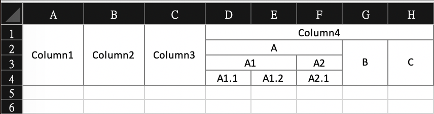

## excelclaim
包裝了 [excelize](https://github.com/360EntSecGroup-Skylar/excelize) 簡化表格的生成。

### what's new ?
1. Fiexd the index problem 
修復了最多只能填到 column Z 的問題

2. Add row merging
並加入了同一 column 中不同 row 的儲存格合併

## example
```go
sheet := excel.NewSheet(xlsx, "test", 8, 15)
sheet.SetAllColsWidth(12, 12, 12, 9, 9, 9, 9, 9)
sheet.WriteRow("|", "|", "|", "-", "-", "-", "-", "Column4")
sheet.WriteRow("|", "|", "|", "-", "-", "A", "|", "|")
sheet.WriteRow("|", "|", "|", "-", "A1", "A2", "|", "|")
sheet.WriteRow("Column1", "Column2", "Column3", "A1.1", "A1.2", "A2.1", "B", "C")
sheet.MergeRow()
sheet.Apply(excel.NewExcelStyle(12, 0, false))
```

