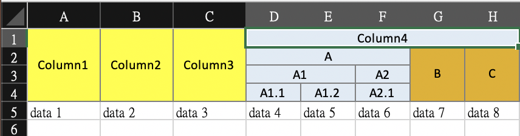

## excelclaim
包裝了 [excelize](https://github.com/360EntSecGroup-Skylar/excelize) 簡化表格的生成。

### what's new ?
1. Fiexd the index problem 
修復了最多只能填到 column Z 的問題

2. Add row merging
加入了同一 column 中不同 row 的儲存格合併

3. Add color setting
儲存格可以設定顏色，但結果看來似乎不太正確


## example
```go
sheet := excel.NewSheet(xlsx, "test", 8, 15)
sheet.SetAllColsWidth(12, 12, 12, 9, 9, 9, 9, 9)

sheet.WriteRow("|", "|", "|", "-", "-", "-", "-", "Column4")
sheet.WriteRow("|", "|", "|", "-", "-", "A", "|", "|")
sheet.WriteRow("|", "|", "|", "-", "A1", "A2", "|", "|")
sheet.WriteRow("Column1", "Column2", "Column3", "A1.1", "A1.2", "A2.1", "B", "C")

sheet.MergeRow() // 合併 "|" 的部分

sheet.SetColor(1, 3, "#ffff00")
sheet.SetColor(4, 6, "#E0EBF5")
sheet.SetColor(7, 8, "#e4b001")

sheet.WriteRow("data 1", "data 2", "data 3", "data 4", "data 5", "data 6", "data 7", "data 8")
```

